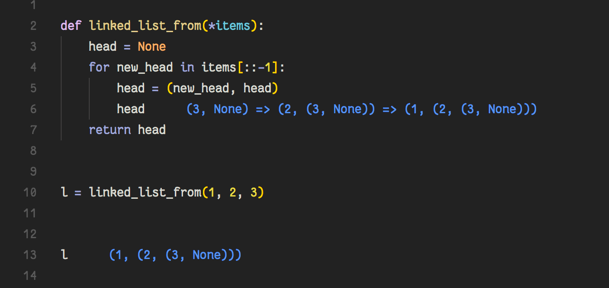

# Wolf - It kicks the Quokkas ass

Wolf is a VsCode extension that enables live inspection of Python code in the editor.

Wolf is Good for:

* Teachers
* Students
* Kids Who love to Code
* API testers
* Code Streamers
* Planet Earth

## Usage

Click the blue Wolf in the upper right action bar inside any open Python source
file to start a session. Once inside a running session, the Wolf icon will change
color to red and can be clicked again to stop the session.

## Features

### Check out variables inline

> NOTE: For this to work you must put only the variable
> name and not an expression; the annotations (16)
> cannot be edited.

---

### Works inside functions!

---

### And nested objects

---

### Works with loops

### and recursion

---

### Highlights errors

---

### Works with http requests!

> NOTE: Please see FAQ section "Will APIs Hate Me?"
> before making requests with Wolf.

---

## Requirements

* Visual Studio Code
* Python 3.5 - 3.6
* `Hunter` library, available on
  PyPi.

> NOTE: If hunter is not found, you will be given the option to
> have it installed into to the "--user" directory automatically.
>
> ie: Wolf will perform `pip install hunter --user` in the cwd of
> the script.

## Extension Settings

This extension contributes the following settings:

* `wolf.barkAtCurrentFile`: Starts Wolf on the current file.
* `wolf.stopBarking`: Stops all running Wolf sessions.

## FAQ

### Can I have the text annotations in cornflower blue?

Abso-fucking-lutely.

### I don't see any annotations

Make sure to save the file you're working on, and that Wolf is activated.
You can try stopping and starting Wolf again on the file to see if this
helps.

### The annotations are everywhere

Sorry, it's a feature for now. Try stopping and starting Wolf
from the command menu to clear the pesky buggers.

### Can my script have relative imports?

Yes. Sorry, I mean, HELL YES!

### Will APIs Hate Me?

That depends. If you code reponsibly and use something like
diskcache or redis to cache your calls, then you'll do just
fine out there. But if you decide to just bang away at some
API without some other sort of caching in place, then it's on
you my friend. Having said that, Wolf will only actually run
your code _on document save_. So you do get a small amount of
throttling by default.

Here's an example using [diskcache](https://pypi.python.org/pypi/diskcache/):

### Do you hate Quokka?

No, I love it. I set out to learn how to decorate text in vscode
and was looking for inspiration, I use Quokka all the time while
hacking away in JS land, and just really missed it when it came
to Python. So I set to work on a simple clone and initially thought
that I would hit a wall very quickly when it came to anything
more than simple regex based stuff in the global scope of the
script. I stumbled upon Hunter almost by accident (Back button
was blurred, so I must have opened it in a new tab.. Probably
reddit), there it was on PyPi with a screenshot _doing exactly
what I needed_. I spent a day on it tops so far and here we are
now. So, again, I love Quokka, and recommend it to everyone
using Javascript. But at the end of the day, the Wolf eats the Quokka.. ;)

### Wolf is stupid.. PDB is better

\*Cue Jingle

Honestly, if you need a real debugger, the one builtin to VSCode is
about as good as it gets. So really, please use that (or `pdb`, `ipdb`)
if you're in need of stuff like breakpoints (or if lives depend on it, ie
please don't use this to debug something like a drug pump ffs, ty).

I see Wolf as more of an exploration tool, for teachers or students
in a learning environment, and definitely for streamers.
You can't get any better than _live feedback next to the code you're editing_!

---

## **Changelog**

## v0.1.5

### Windows Support/Fix

Windows does not support SIGALRM so a custom decorator was provided by Almenon.

### Python 3.5 Support

Newly added support for Python 3.5 was also provided by Almenon.

_Thanks for contributing to Wolf, Almenon!_ :tada:

## v0.1.4 - patch

### Better Stickys

Better sticky handling during multi-line range edits and deletions.

## v0.1.3 - updates

### Sticky annotations during editing

Annotations now stay attached to their line during editing and between
saves. Multi line editing is supported as well. A page save is still
necessary to update the values, this means the script is still only run
when the file is manually saved.

## v0.1.2 - updates

### Gutter Icons

Colored notification icons in the gutter to aid in visual
grepping of Wolf output. Error lines get a red icon while
okay lines get a green icon.

### Shortcut Icons now a Single Toggle Button

The shortcut icons are now a single icon that senses whether
Wolf is running on the current script and updates accordingly.

## v0.1.1 - updates

### Shortcut Icons

New shortcut buttons added to the action bar for easier
starting and stopping.

### Stability

Added a timeout to prevent locking and high cpu usage.

> Bug: This introduced a bug in Windows which was fixed in v0.1.5

## v0.1.0 - minor release

### Much more stable

The previous version of Wolf would crap out a lot due to some
poor choices on my part. Essentially, I tried to make it do
too much too soon. I felt that stabilty should come before
shiny features and have adjusted accordingly. This really
shouldn't affect usability, but if you have other thoughts
please let me know. That feedback is important.

### Proper object printing

Things like nested lists, sets, tuples.. etc, are now printed
properly. Certain structures were flattened during printing
during the last version and it was pretty frustrating, this
should also be fixed but feel free to let me know if you find
a way to break it.

### Shows errors/exceptions

This was a quiet feature in the last release, so not totally
new in 0.1.0. But it wasn't mentioned in the docs before so
I'm making it official now.

### Macros

\* _Removed_ - _Will possibly be re-implemented in a later version_

## v0.0.2 - updates

> Macros ~Removed in 0.1.0~

### Auto evaluate print statements

Wolf now automatically adds annotations for `print` function calls.

**Macros** ~ _Removed in 0.1.0_

## v0.0.1 - initial release

First release of the Wolf. :tada:

---

## I found a bug

You mean a flea? Report any fleas in the issue tracker, please!

## Can I help

That would be awesome. You can shoot me an email or submit a PR. I'm also on
reddit at `/u/Duroktar`. Also, there's plenty of documentation to get started
on your own, if you just want to do that. Welcome one, welcome all!

## Contributors

The following people have contributed to Wolf:

[Almenon](https://github.com/Almenon) - Windows fix and Python 3.5 support ~ [#3](https://github.com/Duroktar/Wolf/pull/3)

## License

Wolf source is available under the Apache 2.0 Software license.
Any dependant libraries are subject to their own licenses and
terms, the most direct of which are listed below.

## Third Party Libraries

[Hunter](https://github.com/ionelmc/python-hunter) - Hunter is a flexible code tracing toolkit. (Honestly, I couldn't have made Wolf without this library.) - [BSD License](https://github.com/ionelmc/python-hunter/blob/master/LICENSE)
